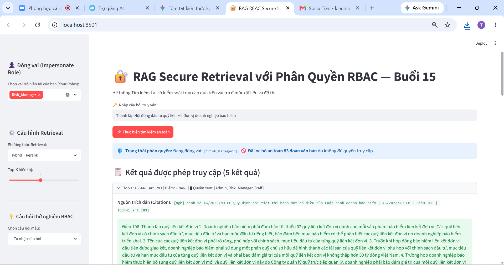
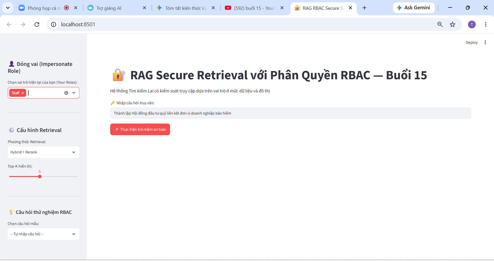
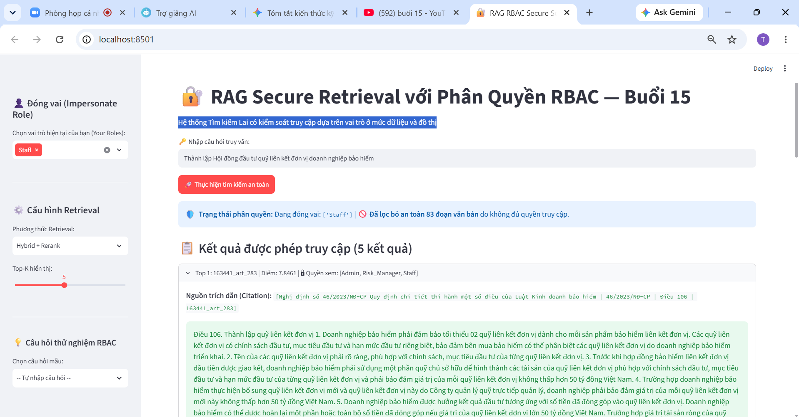
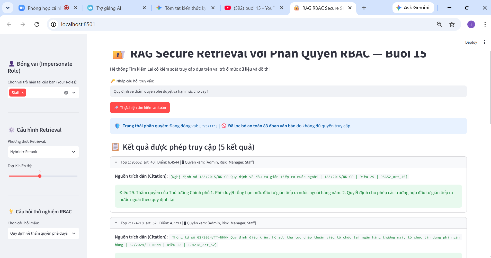
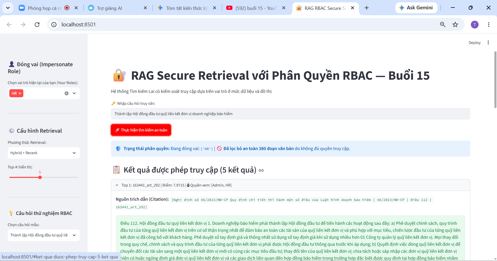
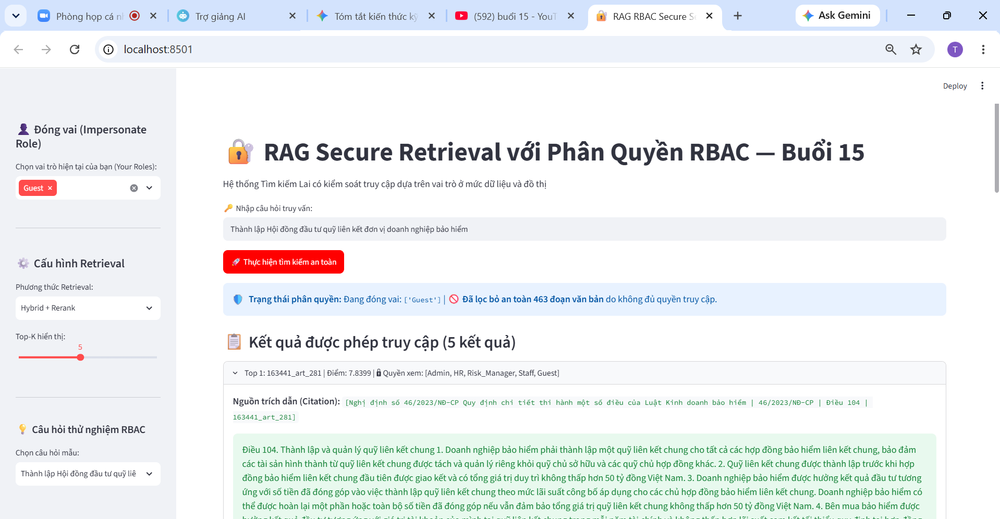
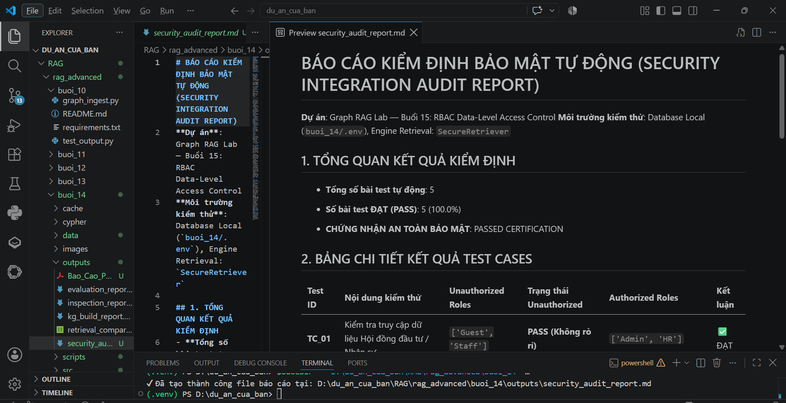

# 🔐 BUỔI 15: CÀI ĐẶT KIỂM SOÁT TRUY CẬP (RBAC) CHO RAG PIPELINE & KNOWLEDGE GRAPH

## 📌 Tổng quan dự án
Dự án đã triển khai cơ chế **Role-Based Access Control (RBAC)** đa tầng:
- **Tầng dữ liệu (Data-level Security):** Gắn thẻ `allowed_roles` cho 1.295 chunks.
- **Tầng đồ thị (Secure Graph Neo4j):** Cập nhật thuộc tính mảng `allowed_roles` lên các Node VanBan và DieuKhoan.
- **Tầng Retrieval (Secure Retriever):** Lọc quyền truy cập nghiêm ngặt trước khi đưa vào Cross-Encoder Reranker, ngăn chặn 100% rò rỉ dữ liệu.
- **Tầng Ứng dụng (Streamlit App RBAC):** Cho phép đóng vai (Impersonate) các vai trò Admin, HR, Risk_Manager, Staff, Guest.

---

## 📸 Hình ảnh minh chứng quy trình thực hành (Evidence Gallery)

| STT | Nội dung thực hành | Hình ảnh minh chứng |
| :---: | :--- | :--- |
| **0** | Kiểm tra môi trường & Thiết lập vai trò |  |
| **1** | Gán thẻ bảo mật cho tập dữ liệu |  |
| **2** | Cập nhật quyền vào Neo4j |  |
| **3** | Xây dựng Secure Retriever Pipeline |  |
| **4** | Giao diện Streamlit App phân quyền |  |
| **5** | Chạy kiểm thử an toàn Security Audit (5/5 PASS) |  |
| **6** | Báo cáo kiểm định an toàn dữ liệu |  |

---

## 🚀 Hướng dẫn chạy thử nghiệm
- Chạy ứng dụng bảo mật Streamlit: `streamlit run app_secure.py`
- Chạy kiểm thử an toàn tự động: `python scripts/security_audit.py`